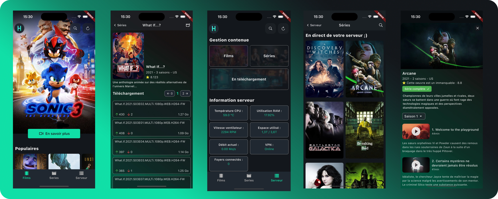

# HomeFlix

Dans le but d’élargir mes compétences, j’ai développé HomeFlix, une application complète permettant de télécharger et de visionner du contenu vidéo (films, séries, documentaires) à partir d’une source distante. L’objectif est d’offrir une expérience utilisateur fluide, moderne et intuitive.

## Architecture du système

### Le système est divisé en trois parties distinctes :

(A) L’application mobile
Une application cross-platform développée avec Flutter. Elle permet d’accéder à toute la bibliothèque disponible sur la source, d’effectuer des téléchargements et de visionner les contenus, que ce soit en ligne ou hors ligne.

(B) L’API serveur
Développée avec Node.js / Express, elle communique avec l’application pour :
- Gérer les téléchargements,
- Organiser la bibliothèque de contenu,
- Transmettre le flux vidéo en streaming,
- Fournir des informations sur l’état du serveur.

(C) L’API source
Cette API est conçue pour récupérer et formater les informations issues de la source distante avant de les transmettre aux autres composants du système. Étant adaptable à différentes sources de contenu, elle n’est pas fournie dans ce projet, laissant ainsi chacun libre de l’implémenter selon ses besoins.

⚠️ Responsabilité : Ce projet est fourni à des fins éducatives et son utilisation doit respecter les lois en vigueur. Je décline toute responsabilité quant à l’usage qui en est fait.

## APIs et technologies utilisées

### APIs mobilisées :
- TMDB API : pour obtenir les informations sur les films et séries,
- API source : à implémenter selon la source choisie,
- API serveur (B) : gestion des téléchargements et du streaming,
- API intermédiaire (C) : traitement et mise en forme des données provenant de la source.

### Technologies principales :
- Flutter : développement de l’application mobile,
- Node.js / Express : gestion du backend et des requêtes API.
	
## Installation et mise en route

### Serveur et API

- Sur votre serveur/ordinateur linux faire : sudo su

- Taper son mot de passe

- Faire : git clone https://github.com/Youvataque/HomeFlix && cd Homeflix/Installation

- Ouvrir avec un éditeur de text "start.sh"

- Modifier : PASSKEY="Votre clef si il y en a une pour le site de torrent" ; SRC_GIT="Le lien github de votre API C (celle qui gère la source)" ; API_KEY="La clef api souhaité pour le serveur"

- Taper : chmod u+x start.sh && ./start.sh

- Le serveur se configure et se lance.

### App mobile (Android)

- Télécharger et installer le .apk présent dans Homeflix/Installation/Android sur votre téléphone

- Lancer l'app et taper : la clef api que vous avez choisi, l'api de votre serveur, le port du serveur (par défault 5001).

- C'est pret !

### VPN (Niveau plus avancé mais optionnel)

- Pour se connecter au docker il faut faire : ssh root@votre_ip -p 2222 (le mot de passe est "root").

- Installer votre VPN favori avec un fichier de configuration openVPN (openvpn.udp) (car celui-ci ne réécrit pas systématiquement les priorités des interfaces réseaux).

- Modifier sa priorité réseau avec : sudo nmcli connection modify "nom du fichier openvpn.udp" ipv4.route-metric 200

- Lancer le vpn avec : sudo nmcli connection up "nom du fichier openvpn.udp" --ask (il faudra saisir la clef trouvable sur le site du vpn choisi)

- ajouter [VPN_PASS="votre clef vpn"] à votre root/API/.env (dans le docker).

- Enfin, aller dans qbittorrent et dans les paramètres avancés, sélectionner tun0 dans Network interface.
  
- Dans le dossier de l'api puis src/app.ts ajouter "startVpnWatcher()" pour lancer le controller de l'api (relance automatique etc).

### En cas de besoin ou de suggestion

Vous pouvez trouver de quoi me contacter sur mon site internet (il est joint à ce GitHub).
